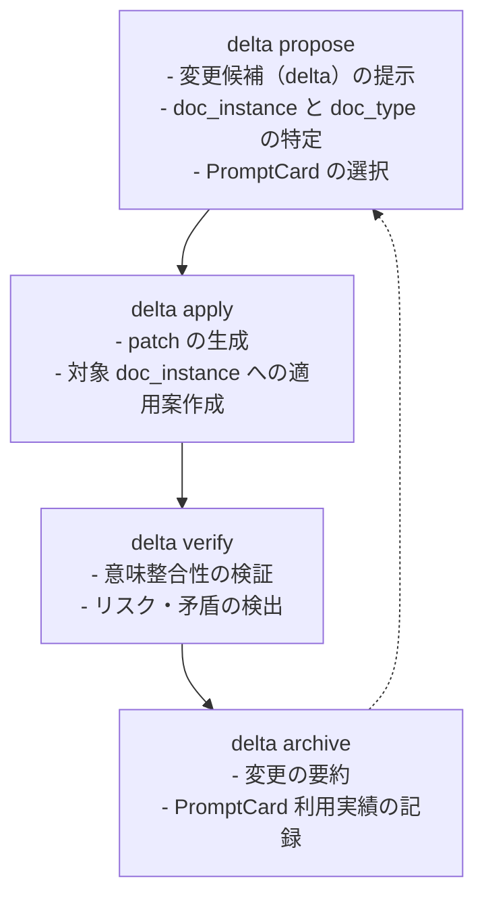

# context-delta 全体アーキテクチャ仕様書  
**（doc_type と PromptCard を含む統合版）**

---

## 0. 位置づけと目的

context-delta は、ソフトウェア開発における変更作業（delta）を、  
**「一個流し（One-Piece-Flow）」と「プロアクティブなコンテキスト管理」** に基づいて構造化するための仕組みである。

典型的な課題：

- 仕様・設計・コード・ドキュメントが、バラバラに更新されていく
- LLM に大きな塊で“全部お願い”すると、一貫性が崩壊しやすい
- 生成物の品質が「その場限り」になり、次の変更に学びが活かされない

context-delta はこれに対し、

- **小さな delta 単位**で変更を刻む
- 変更の前後を **propose / apply / verify / archive** の 4 コマンドで管理する
- 変更時に触れる文書群を **doc_type / doc_instance** として型付けする
- その doc_type ごとに **PromptCard** を紐づけ、生成・評価のルールを明示する

ことを狙う。

---

## 1. 基本コンセプト

### 1-1. delta（変更単位）

**delta** は、プロジェクトに対して行う「意味のある最小変更単位」を表す。

特徴：

- 1 回の delta は、原則として 1 つの明確な目的に絞る
- 「ついでのついで」のような変更は含めない（後続の delta に回す）
- 各 delta は `propose → apply → verify → archive` の 1 サイクルを持つ

---

### 1-2. doc_type（文書の“型”）

**doc_type** は、文書・仕様・設定ファイルなどの「役割」を表す抽象的な型である。  
ファイルパスや拡張子とは独立しており、「その文書が何のために存在するのか」を示す。

例：

- `req.usdm` : USDM 形式の要求仕様書
- `spec.api` : 外部向け API 仕様書
- `spec.domain_model` : ドメインモデル仕様
- `design.arch_overview` : 全体アーキテクチャ概要
- `test.plan` : テスト計画書
- `ops.runbook` : 運用 Runbook
- `delta.summary` : 各 delta のサマリ用文書
- `delta.principles` : アーカイブ時に抽出された原則集

doc_type は「このプロジェクトではどんな文書の型を使うか」という **アーキテクチャの一部** と考える。

---

### 1-3. doc_instance（型付き文書インスタンス）

**doc_instance** は、「doc_type が何で、どのファイルを指しているか」を表す具体的なインスタンスである。

典型的な構造（論理モデル）：

```jsonc
{
  "doc_id": "spec-api-v1-main",
  "doc_type": "spec.api",
  "path": "docs/specs/api/main_api_spec.md",
  "scope": "v1 public REST endpoints",
  "lifecycle": "active"  // draft | active | archived | obsolete
}
```

- `doc_id` : プロジェクト内で一意な識別子
- `doc_type` : 上記の型ラベル
- `path` : 実ファイルパス
- `scope` : カバーする範囲（v1/v2、特定サービスなど）
- `lifecycle` : ライフサイクル状態

**delta propose / apply / verify / archive** は、常に doc_instance を明示的に扱う。  
「どの doc_type の、どのインスタンスを、どう変更するのか」が常に見えるようにする。

---

### 1-4. PromptCard（doc_type ごとの生成・評価ルール）

**PromptCard** は、「ある doc_type の文書を LLM にどう生成／評価させるか」を定義したカードである。

構造イメージ（YAML 例）：

```yaml
id: promptcard.req.usdm.default
doc_type: req.usdm
mode: generate   # generate | revise | evaluate | explain など
role: "USDM形式の要求仕様の専門家"
instructions: |
  あなたは USDM 形式の要求仕様書の専門家です。
  以下の入力情報をもとに、USDM の観点から要求を整理してください…
rubric: |
  - 利用者視点のシナリオが列挙されていること
  - 例外系・エラーケースが明示されていること
  - 非機能要求が明確に記載されていること
```

特徴：

- `doc_type` に紐づいているため、**型ごとのノウハウを再利用できる**
- `mode` に応じて、生成用・リライト用・評価用などに分けられる
- delta-forge などの仕組みで、**ログから継続的に改善（アップデート）される**

---

### 1-5. PromptCard の初期リストと doc_type 推定

- `init` のタイミングでインストールされる PromptCard を走査し、  
  **「doc_type と PromptCard ファイルの一覧表」** を作成する。
- PromptCard のメタデータに `doc_type` を必ず含めることで、  
  初期一覧を見ればプロジェクトが扱う doc_type を推定できる。
- 人手で doc_type を追加する場合も、この一覧を出発点にする。
- PromptCard は Markdown ファイル（`.md`）を前提とし、パスも明示して一覧に含める。
- 一覧表の例（`promptcards/index.json`）：
  ```jsonc
  {
    "promptcards": [
      {
        "doc_type": "req.usdm",
        "promptcard_id": "promptcard.req.usdm.default",
        "mode": "generate",
        "path": "promptcards/req.usdm/default.md"
      },
      {
        "doc_type": "req.usdm",
        "promptcard_id": "promptcard.req.usdm.review",
        "mode": "evaluate",
        "path": "promptcards/req.usdm/review.md"
      }
    ]
  }
  ```

### 1-6. 最小 doc_type リスト（推奨初期セット）

初期導入時は、以下を最小セットとして扱うことを推奨する。必要に応じて追加する。

- `req.usdm` : 要求仕様（USDM 形式でなくても可、要求を一元化）
- `spec.api` : 外部／内部 API 仕様
- `design.arch_overview` : アーキテクチャ概要
- `test.plan` : テスト計画・観点
- `ops.runbook` : 運用・障害対応手順
- `delta.summary` : 各 delta の要約（変更の意図と結果）

## 2. コマンドセットとフロー概要

context-delta の外部インターフェイスは、以下の 4 コマンドのみとする。

- `delta propose`
- `delta apply`
- `delta verify`
- `delta archive`
- `delta list`
- `delta delete`

### 2-1. 全体フロー（概念図）



`delta concept` という専用コマンドは存在せず、  
**概念整理・状況把握の役割は `delta propose` 内部のフェーズとして吸収される**。  
Archive はエッセンスのメモだけを残し、必要に応じて次の propose の入力とする。

### 2-2. 管理系コマンド（delta list / delta delete）

- `delta list`  
  - アーカイブされていない delta（未着手・進行中）を一覧表示する。  
  - 代表的な出力（最小構成）：
    ```jsonc
    {
      "delta_list": [
        { "id": "delta-001", "title": "要求: Xを追加", "status": "proposed" },
        { "id": "delta-002", "title": "API仕様: Xを反映", "status": "apply-in-progress" }
      ]
    }
    ```
- `delta delete`  
  - 着手前（proposed 状態）の delta を削除するユーティリティ。  
  - 入力は `delta_id` のみ。アーカイブ済みは削除しないルールとし、欠番はそのまま残す。

### 2-3. delta_id の指定ルール

- `delta apply` / `delta verify` / `delta archive` は、対象を明示するために `--delta-id`（または positional の delta_id）を受け付ける。
- `--delta-id` が省略された場合は、最後に `delta propose` で生成された未アーカイブの delta をデフォルト対象とする運用を推奨する（実装側で記憶）。
- `delta list` により複数の未アーカイブ delta を確認し、必要に応じて個別の `--delta-id` を指定して apply を進める。

### 2-4. status ラベルの最小定義

- `proposed` : propose 済み、apply 未実行
- `apply-in-progress` : apply 実行中（パッチ検討を含む）
- `verify-in-progress` : verify 実行中
- `archived` : archive 済み（`delta list` の対象外）

---

## 3. `delta propose` 仕様（doc_type / PromptCard 連携込み）

### 3-1. 目的

`delta propose` は、変更作業の起点として、以下を行う：

- 必要な **delta（変更単位）の列挙**
- 関連する **doc_instance の特定**
- 各 doc_instance の **doc_type の明示**
- 使用すべき **PromptCard の決定**（または候補提示）
- 変更の意図（intent）の言語化
- リスクと依存関係の推定

また、`--bootstrap` オプションによって、

- 既存プロジェクトに context-delta を後付け導入する際の  
  **状況把握・ロードマップ生成（旧 Concept 相当）**
- プロジェクトで採用すべき **doc_type セットの提案**

も行う。

---

### 3-2. 入力

- プロジェクトのファイル群
- `init` で生成された PromptCard 一覧表（doc_type 推定用）
- 既存の doc_instance 定義（あれば）
- オプション：`--bootstrap`

---

### 3-3. 出力（代表的な JSON 構造）

```jsonc
{
  "mode": "incremental", // or "bootstrap"
  "delta_list": [
    {
      "id": "delta-001",
      "title": "USDM形式の要求仕様を書き起こす",
      "intent": "現状の口頭要件を、USDM形式の要求仕様として明文化する",
      "doc_instances": [
        {
          "doc_id": "req-usdm-main",
          "doc_type": "req.usdm",
          "path": "docs/requirements/usdm.md",
          "promptcard_id": "promptcard.req.usdm.default",
          "verify_promptcard_id": "promptcard.req.usdm.review"
        }
      ]
    }
  ],
  "next_steps": {
    "recommended_delta_ids": ["delta-001"]
  }
}
```

---

### 3-4. bootstrap モード時の追加出力（doc_type 設計）

`delta propose --bootstrap` の場合、追加で次の情報を返す：

```jsonc
{
  "doc_type_plan": [
    {
      "doc_type": "req.usdm",
      "purpose": "要求仕様の単一ソースとして機能させる",
      "promptcards": [
        "promptcard.req.usdm.default",
        "promptcard.req.usdm.review"
      ]
    },
    {
      "doc_type": "spec.api",
      "purpose": "外部公開 API の仕様を統一フォーマットで管理する",
      "promptcards": [
        "promptcard.spec.api.default"
      ]
    }
  ]
}
```

これにより、プロジェクトとして：

- 「どの doc_type を採用するか」
- 「各 doc_type に対し、どの PromptCard を使うか」

を初期合意し、この計画をそのまま最初の `delta propose` の候補（doc_instance 作成や空ファイル作成など）に落として進める。

---

### 3-5. 内部ロジック規範

- 変更単位（delta）は **小さく** 分割する（One-Piece-Flow）
- doc_instance は必ず **doc_type を伴って**提案する
- doc_type に紐づく PromptCard を優先的に利用し、  
  無い場合は「新規 PromptCard が必要」として人間に問いかける
- 生成対象は「必要な doc_type の doc_instance」に限る（余計なファイルを作らない）

---

## 4. `delta apply` 仕様（doc_instance 単位での適用）

### 4-1. 目的

`delta apply` は、`delta propose` で決めた delta を、

- 具体的なファイル変更（patch）として具現化し
- doc_instance ごとに適用案を提示する

ためのコマンドである。

---

### 4-2. 入力

- `delta propose` の出力（選択された delta）
- 対象 doc_instance の現行内容（`path` で指定されたファイル）
- 該当 doc_type に紐づく PromptCard（`promptcard_id`）

---

### 4-3. 出力

```jsonc
{
  "delta_id": "delta-001",
  "results": [
    {
      "doc_id": "req-usdm-main",
      "doc_type": "req.usdm",
      "path": "docs/requirements/usdm.md",
      "before": "（適用前の全文）",
      "after": "（適用後の全文）",
      "patch": "（Unified Diff 形式の差分）"
    }
  ]
}
```

---

### 4-4. PromptCard との関係

- `delta apply` は、`delta propose` で指定された `promptcard_id` を使って、  
  LLM に「どう書き換えるか」を指示する。
- PromptCard の `mode` は通常 `generate` または `revise` を想定。
- apply の結果は、後続の `delta verify` と `delta archive` に渡される。

---

### 4-5. 内部ロジック規範

- **必要最小限の変更**に留める（大規模な書き換え禁止）
- 文脈を変える必要がある場合は、概要を summary で説明する
- ファイルの構造や章構成を勝手に大きく組み替えない（別の delta に回す）

---

## 5. `delta verify` 仕様（意味整合性と原則チェック）

### 5-1. 目的

`delta verify` は、`delta apply` の結果が：

- 元の intent（意図）
- 当該 doc_type の期待役割（PromptCard / rubric）
- 他の doc_instance との整合性

と矛盾していないかを、**意味レベルで検証する**コマンドである。

---

### 5-2. 入力

- `delta apply` の結果（before/after/patch）
- `delta propose` の intent / rationale
- 当該 doc_type に対応する PromptCard（評価用 / review 用）

---

### 5-3. 出力

```jsonc
{
  "delta_id": "delta-001",
  "verification": {
    "issues": [
      {
        "doc_id": "req-usdm-main",
        "loc": "line 120-150",
        "issue": "元の要求よりも範囲が広く解釈されています。",
        "note": "…",
        "severity": "high"
      }
    ],
    "suggested_followup": [
      {
        "type": "new_delta_propose",
        "reason": "semantic_drift を是正するための delta を提案すべきです。"
      }
    ]
  }
}
```

---

### 5-4. PromptCard との関係

- verify では、`doc_type` に対応する **評価用 PromptCard** を参照する。
- PromptCard の rubric を使って、
  - 必須項目の欠落
  - 一貫性の欠如
  - ドメイン原則違反  
  などを検出する。

---

### 5-5. 内部ロジック規範

- 構文レベルのチェック（lint）は補助であり、**意味レベル（semantic）の検証が主役**
- 不明点は「エラー」ではなく「質問」として `suggested_followup` に載せる

---

## 6. `delta archive` 仕様（エッセンス記録）

### 6-1. 目的

`delta archive` は、変更のエッセンスを短く残し、次の `delta propose` で参照できるようにするためのコマンドである。  
詳細なナレッジ蓄積（E-PDC や PromptCard 改善）は別プロジェクトで扱う前提とし、本プロジェクトでは最小限にとどめる。

---

### 6-2. 入力

- `delta propose` の intent / doc_instances 情報
- `delta apply` の before / after / patch
- `delta verify` の verification 結果（あれば）
- 使用された PromptCard の ID（記録目的）

---

### 6-3. 出力とファイル構造

代表的なディレクトリ構造（エッセンスのみ）：

```text
delta_archive/
  2025-11-18_142300/
      summary.md
      apply.patch
      doc_instances.json
```

各ファイルの役割：

- `summary.md`  
  - 何を・なぜ・どう変えたかの要約（人間向け、数行）
- `apply.patch`  
  - 実際に適用した差分（Unified Diff）
- `doc_instances.json`  
  - 対象 doc_instance と使用した `promptcard_id` のシンプルな記録

---

## 7. まとめ：doc_type × PromptCard × delta のループ

本仕様で整理された関係は、次のようにまとめられる。

- **doc_type**  
  → プロジェクトが扱う文書の「型」。役割と期待アウトカム。

- **doc_instance**  
  → doc_type を持った具体的な文書（ファイル）インスタンス。

- **PromptCard**  
  → doc_type ごとの「どう書くか／どう評価するか」のノウハウ。  
    LLM に渡すプロンプト＋評価基準のパッケージ。

- **delta（propose → apply → verify → archive）**  
  → 小さな変更単位を 4 ステップで扱うワークフロー。  
    アーカイブされたエッセンスを次の propose の判断材料として用いる。

このループを回し続けることで、

- プロジェクト固有の「型付きドキュメント文化」が醸成され
- PromptCard は実運用のログに基づいて適切に選択され
- LLM による支援は「一発生成」ではなく、変更作業を安定させるパートナーになっていく。

---

（以上）
